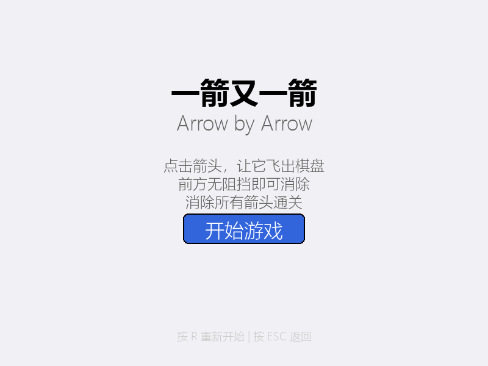
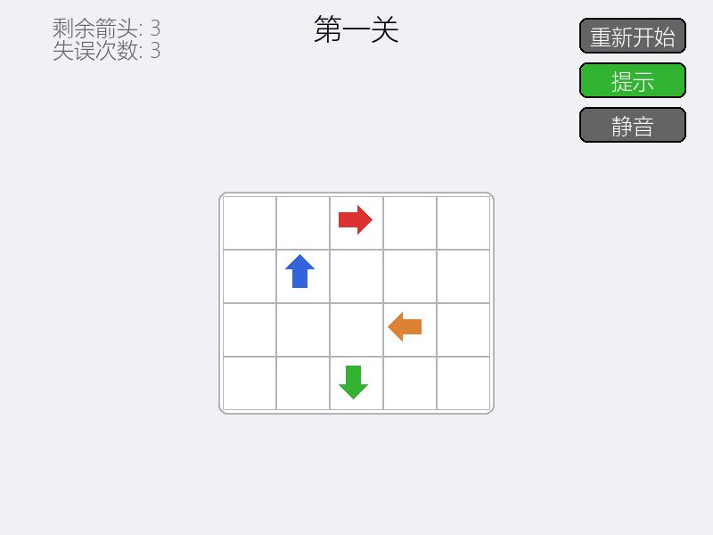

# 2026 秋软件工程个人作业（第二次）

| 项目内容 | 内容 |
| --- | --- |
| 这个作业属于哪个课程 | 2026 软件工程 |
| 这个作业要求在哪里 | 第二次个人作业（请在发布前补充课程作业要求链接） |
| 这个作业的目标 | 使用 Python 和 AIGC 完成“一箭又一箭”小游戏 |
| 学号 | 102401421 |
| GitHub 仓库 | [arrow-game](https://github.com/trony33/arrow-game) |

## 一、项目展示

项目提供了截图生成脚本 `generate_screenshots.py`。发布报告前运行以下命令，即可在 `screenshots/` 目录生成展示图片：

```bash
python generate_screenshots.py
```

### 开始界面

开始界面显示中英文游戏名称、基本规则和“开始游戏”按钮。



### 游戏界面

游戏界面显示当前关卡、剩余箭头、剩余失误机会、棋盘，以及重新开始、提示和静音按钮。


### 箭头飞出效果

点击前方没有阻挡的箭头后，箭头沿自身方向飞出棋盘并逐渐淡出。



### 重新开始界面

点击“重新开始”按钮或按 `R` 键，可以恢复当前关卡的初始布局和失误次数。


> 说明：仓库目前未保存上述截图文件。提交博客或报告前，需要先执行截图生成命令并将生成的图片加入仓库。当前项目也没有游戏演示视频，因此本报告不虚构视频链接。

## 二、项目介绍

“一箭又一箭”是一款使用 Python 和 Pygame 开发的点击式箭头解谜游戏。棋盘中的箭头分别朝上、下、左、右。玩家需要观察箭头之间的阻挡关系，并按照合适的顺序点击箭头，最终清空棋盘。

点击一支箭头时，程序会检查该箭头到棋盘边界之间的所有格子。如果路径上没有其他箭头，当前箭头就会飞出棋盘并消失；如果路径上存在阻挡，箭头会变红并晃动，同时累计一次失误。界面显示的是剩余失误机会，当累计失误达到本关上限时，游戏进入失败状态。

项目包含 5 个固定关卡，棋盘规模和箭头数量逐步增加。前两关最多允许 3 次失误，第三、四关允许 2 次，第五关仅允许 1 次。清除当前关卡的全部箭头后，可以进入下一关；完成第五关后显示全部通关界面。

除基础玩法外，项目还实现了以下功能：

- 开始、游戏、单关通关、失败和全部通关界面；
- 箭头飞出、碰撞晃动、悬停高亮和提示闪烁效果；
- 显示关卡名称、剩余箭头和剩余失误机会；
- 点击按钮或按 `R` 键重新开始当前关卡；
- 点击“提示”按钮或按 `H` 键，高亮一支当前可消除的箭头；
- 点击静音按钮或按 `M` 键开关音效；
- 使用程序合成飞出、碰撞、通关、失败和按钮点击音效。

运行环境为 Python 3.8 及以上版本、Pygame 2.5.0 及以上版本。音效合成还使用了 NumPy，但当前 `requirements.txt` 只声明了 Pygame，因此首次运行前还需要确认环境中已安装 NumPy。游戏可通过以下命令启动：

```bash
pip install -r requirements.txt
pip install numpy
python main.py
```

## 三、实现思路

### 3.1 项目结构

项目按照游戏规则、界面和辅助功能进行拆分：

| 文件 | 主要职责 |
| --- | --- |
| `game.py` | 箭头对象、路径检测、点击处理和游戏状态管理 |
| `levels.py` | 方向常量和 5 个固定关卡的二维数组数据 |
| `main.py` | Pygame 主循环、事件处理、界面绘制和动画显示 |
| `hints.py` | 查找并闪烁提示当前可消除的箭头 |
| `sounds.py` | 使用 Pygame 和 NumPy 合成、播放及开关音效 |
| `test_game.py` | 路径检测、点击逻辑、流程和关卡基础有效性测试 |
| `generate_screenshots.py` | 自动生成项目展示截图 |

### 3.2 数据表示

每支箭头由行坐标、列坐标、方向和运行状态组成。关卡使用二维列表表示，其中 `0` 表示空格，`1`、`2`、`3`、`4` 分别表示上、下、左、右四个方向。加载关卡时，程序复制初始棋盘并创建对应的 `Arrow` 对象；重新开始时再次加载当前关卡，从而恢复棋盘和失误次数。

游戏状态分为菜单、游戏中、全部通关、失败和单关完成。界面根据当前状态绘制不同页面，游戏规则本身集中在 `Game` 类中。

### 3.3 路径检测

路径检测是游戏的核心。程序从被点击箭头旁边的格子开始，沿箭头方向逐格检查，直到到达棋盘边界。遇到第一个非空格子时，说明路径被阻挡；如果直到边界都没有遇到箭头，则允许飞出。

以下是 `Game.check_path()` 中向上和向右检测的关键代码，其他两个方向采用同样的方法：

```python
if direction == UP:
    for row in range(r - 1, -1, -1):
        if self.grid[row][c] != EMPTY:
            blocking_arrows.append((row, c))
            return False, blocking_arrows
    return True, []

elif direction == RIGHT:
    for col in range(c + 1, self.cols):
        if self.grid[r][col] != EMPTY:
            blocking_arrows.append((r, col))
            return False, blocking_arrows
    return True, []
```

路径畅通时，程序把箭头标记为已消除，将棋盘对应位置设为空，并把箭头加入飞行动画列表。路径受阻时，程序增加 `errors`，启动 30 帧碰撞动画，并检查是否达到本关的最大失误次数。

### 3.4 界面、动画与辅助功能

`main.py` 以 60 FPS 运行事件、更新和绘制循环。飞出动画通过持续增加 `fly_progress`，让箭头沿当前方向移动约 300 像素并逐渐降低透明度；碰撞动画使用正弦和余弦计算小幅位移，同时将箭头绘制为红色。

提示系统遍历仍然存在的箭头，调用同一个 `check_path()` 方法寻找第一支路径畅通的箭头，再以黄色闪烁方式显示 60 帧。这样提示功能复用了核心规则，没有单独复制一套判断逻辑。

音效模块使用正弦波生成简单音调，不依赖商业游戏素材。不同频率和持续时间分别对应飞出、碰撞、通关、失败和点击反馈，并支持统一静音。

## 四、AIGC 使用过程

本项目使用的 AIGC 工具为 Claude（Sisyphus）。我负责提出需求、试玩、检查关卡和反馈问题，AIGC 主要用于生成代码框架、辅助实现功能和编写测试。

| 子任务 | AIGC 工具 | 提出的要求 | AI 实现或提供了什么 | 实际效果 | 审核与修改 |
| --- | --- | --- | --- | --- | --- |
| 核心路径逻辑 | Claude（Sisyphus） | 实现四方向箭头的阻挡检测 | 生成 `Game.check_path()` 和点击处理框架 | 四个方向的基础判断可用 | 通过边缘和阻挡用例检查结果，并补充自动化测试 |
| Pygame 界面 | Claude（Sisyphus） | 绘制菜单、棋盘、信息栏和结算界面 | 生成 Pygame 主循环、按钮与箭头绘制代码 | 基础界面可以运行 | 在此基础上增加提示、音效、静音和快捷键功能 |
| 关卡设计 | Claude（Sisyphus） | 生成 5 个难度递增的固定关卡 | 提供二维数组形式的关卡数据 | 第四关最初存在两支箭头互相阻挡的死锁 | 人工分析阻挡关系并重新设计第四关，项目文档记录了五关的人工验证路径 |
| 测试与调试 | Claude（Sisyphus） | 测试路径检测、点击逻辑和关卡流程 | 生成 `test_game.py` 自动化测试脚本 | 测试能够覆盖主要规则，但 Windows 终端出现 Unicode 对勾显示问题 | 将测试输出中的特殊对勾替换为 `[OK]`，再次执行后通过 |

AIGC 加快了从需求到可运行程序的过程，但生成结果不能直接等同于正确结果。第四关的死锁就是一个典型例子：代码可以运行，并不表示关卡一定可通关。最终仍需要人工试玩、分析阻挡依赖并通过测试检查行为。

## 五、测试结果

本次核验在项目目录执行：

```bash
python test_game.py
```

脚本正常退出，并输出“所有测试通过”。自动化测试实际覆盖了 5 个路径检测场景、2 类点击行为、3 项游戏流程检查，以及 5 个关卡的非空和箭头数量检查。

| 编号 | 测试内容 | 预期结果 | 实际结果 | 是否通过 |
| --- | --- | --- | --- | --- |
| T01 | 前方无阻挡的箭头路径检测 | 返回可飞出且无阻挡位置 | `check_path()` 返回可飞出 | 通过 |
| T02 | 前方存在其他箭头 | 返回不可飞出并给出阻挡位置 | 正确识别阻挡箭头 | 通过 |
| T03 | 位于边缘且朝棋盘外的箭头 | 可直接飞出，不发生越界 | 向上边缘用例正常通过 | 通过 |
| T04 | 点击可消除的箭头 | 箭头标记为消除，棋盘位置清空 | 点击返回成功，箭头不再存活 | 通过 |
| T05 | 点击被阻挡的箭头 | 箭头保留，累计一次失误 | 点击返回失败，失误数增加 1 | 通过 |
| T06 | 加载和重新开始关卡 | 游戏进入进行中，布局和失误状态恢复 | 状态正确，失误数重置为 0 | 通过 |
| T07 | 从单关完成进入下一关 | 当前关卡编号增加并加载新关卡 | 成功进入第二关 | 通过 |
| T08 | 关卡基础有效性 | 每关棋盘非空并至少包含一支箭头 | 5 关分别包含 4、5、7、7、8 支箭头 | 通过 |

需要说明的是，`test_game.py` 对关卡有效性的自动检查只验证棋盘非空和箭头数量，并没有实现完整求解器。因此，“所有关卡均可通关”的结论来自项目开发过程中的人工分析和文档记录，而不是该自动化测试本身的数学证明。开始、通关、失败页面以及音效和动画仍属于需要实际运行游戏进行观察的界面行为。

## 六、PSP 表格

| 任务 | 预估耗时（小时） | 实际耗时（小时） | 差异（小时） |
| --- | ---: | ---: | ---: |
| 需求分析与游戏设计 | 1.0 | 1.5 | +0.5 |
| Python 与图形库学习 | 1.5 | 1.0 | -0.5 |
| 游戏界面实现 | 2.0 | 2.5 | +0.5 |
| 路径与碰撞逻辑实现 | 1.5 | 2.0 | +0.5 |
| 关卡设计 | 1.0 | 2.0 | +1.0 |
| AIGC 辅助开发 | 2.0 | 1.5 | -0.5 |
| 测试与修改 | 1.5 | 2.0 | +0.5 |
| README 与博客撰写 | 1.0 | 1.5 | +0.5 |
| **合计** | **11.5** | **14.0** | **+2.5** |

实际耗时比预估多 2.5 小时，差异主要来自关卡设计、界面完善和测试修改。尤其是第四关出现死锁后，需要重新分析箭头之间的依赖关系并调整布局。另一方面，AIGC 提供了较完整的 Pygame 和路径检测代码框架，降低了图形库学习和基础代码编写的成本。

## 七、心得体会

通过这次作业，我认识到 AIGC 的优势是能够快速把需求转化为代码框架，并为不熟悉的 Pygame 图形开发提供参考。路径检测、界面绘制和测试脚本都可以在 AI 的帮助下较快形成可运行版本，使我能够把更多时间放在试玩和功能调整上。

但 AIGC 生成的内容仍然需要人工审核。第四关最初虽然数据格式正确、程序也能正常加载，却因为两支箭头互相阻挡而无法完成。如果只检查程序是否启动，就无法发现这个问题。通过实际分析箭头的前进方向、重新设计关卡，并记录通关顺序，我体会到“能够运行”和“逻辑正确”之间仍有明显区别。

测试过程也让我认识到自动化测试结论必须与实际覆盖范围一致。当前测试可以验证路径、点击和基础流程，但关卡有效性测试并不是真正的求解器，界面动画与音效也需要人工运行观察。因此，在使用 AIGC 和自动化工具时，既要利用它们提高效率，也要清楚它们验证了什么、没有验证什么。只有把 AI 辅助、自动化测试和人工试玩结合起来，才能逐步提高项目的完整性和可靠性。
